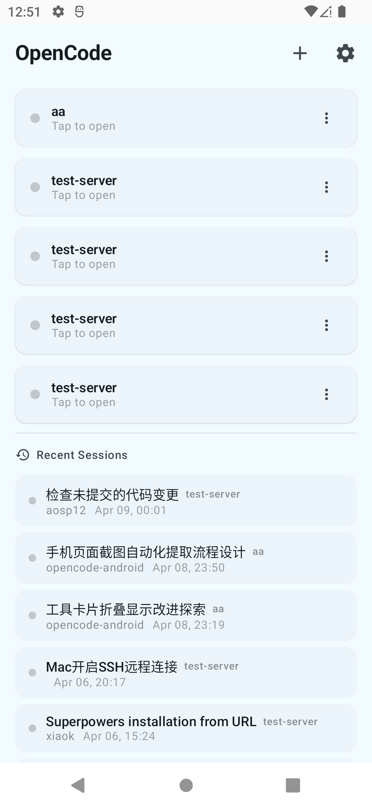
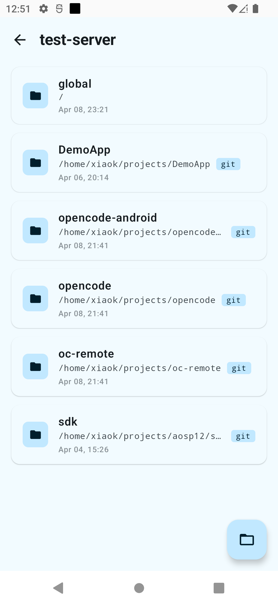
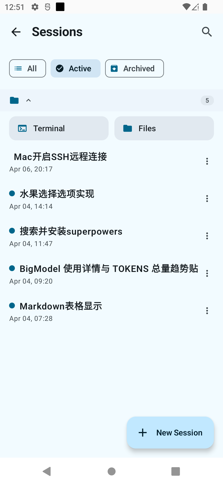
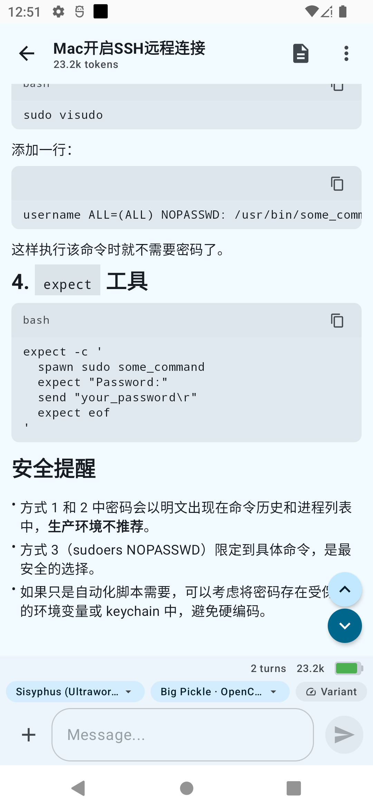

# OpenCode Android

> ⚠️ **Disclaimer**: This is an **unofficial** community project and is NOT affiliated with or endorsed by the official OpenCode team.

An Android client for [OpenCode](https://opencode.ai/) — an open-source AI coding assistant platform (134K+ GitHub Stars). The app connects to a running OpenCode server via its HTTP REST API and SSE event stream, providing a native mobile experience for managing coding sessions, chatting with AI agents, browsing files, and monitoring tool executions.

This project is forked from [OC Remote](https://play.google.com/store/apps/details?id=dev.minios.ocremote) (the official OpenCode Remote Android app), rebuilding it with an MVI + EventReducer architecture for improved state management and extensibility.

## Architecture

**MVI + EventReducer (Redux-like)** — SSE event-driven architecture. All real-time events flow through a central `EventReducer`, exposing immutable `StateFlow`s that ViewModels subscribe to, driving Compose UI re-composition.

```
SSE Event → EventReducer → StateFlow → ViewModel → Compose UI
```

For detailed architecture documentation, see [ARCHITECTURE.md](./ARCHITECTURE.md).

## Screenshots

<p align="center">
  
  
  
  
</p>

## Project Status

🚧 **Early Development** — Architecture planning complete, implementation starting.

## Build

```bash
./gradlew assembleDebug
```

Requires Android SDK with compileSdk 36. Keystore already configured via `keystore.properties`.

## License

MIT
